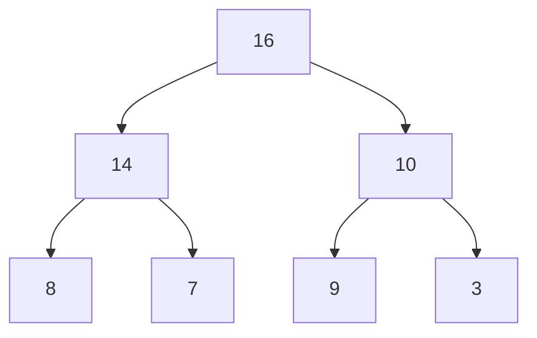
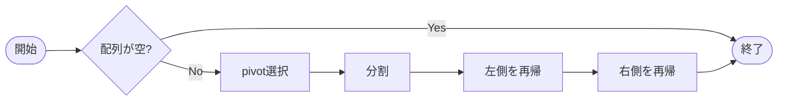

# CLAUDE.md — CLRS 授業資料生成ガイド

このファイルはCLRS（Introduction to Algorithms）の授業資料をMarkdownで生成するための指示書です。

---

## プロジェクト概要

**目的**: CLRSに基づくアルゴリズム授業資料をMarkdown形式で作成する  
**対象**: 大学生・大学院生向け講義資料  
**フォーマット**: Markdown（LaTeX数式・Mermaidグラフ含む）

---

## ビルド環境とリポジトリ構成

この資料は **[VitePress](https://vitepress.dev/)** で静的サイトとしてビルドし、GitHub Pages に公開している。

### ツールチェーン

| 項目 | バージョン / 設定 |
|------|------------------|
| 静的サイトジェネレータ | VitePress `^1.6.4` |
| Node.js | `22.22.3`（`package.json` の `volta` でピン留め） |
| npm | `10.9.8` |
| モジュール形式 | ESM（`package.json` の `"type": "module"`） |
| 数式レンダリング | VitePress 組み込みの MathJax（`config.ts` の `markdown.math: true`）。`markdown-it-mathjax3` も devDependency に含む |
| 図のレンダリング | `vitepress-plugin-mermaid` + `mermaid`（` ```mermaid ` ブロックを描画） |

### ディレクトリ構成

```
clrs/
├── package.json              # VitePress と npm scripts
├── CLAUDE.md                 # このファイル
├── .github/workflows/
│   └── deploy.yml            # GitHub Pages への自動デプロイ
└── docs/
    ├── index.md              # トップページ（章一覧）
    ├── .vitepress/
    │   └── config.ts         # サイト設定（nav・sidebar・lang など）
    └── chapter-{N}/
        └── clrs-c{N}-{YYYYMMDD}.md   # 各章の本文
```

### npm scripts

```bash
npm install            # 依存関係のインストール（初回のみ）
npm run docs:dev       # ローカル開発サーバ（ホットリロード）
npm run docs:build     # 本番ビルド（出力先: docs/.vitepress/dist）
npm run docs:preview   # ビルド結果をローカルで確認
```

`dev` / `build` / `preview`（`docs:` 接頭辞なし）も同じ動作のエイリアスとして用意してある。

### デプロイ

- `.github/workflows/deploy.yml` により、**`main` への push で自動的に GitHub Pages へデプロイ** される（手動実行 `workflow_dispatch` も可）。
- CI は Node 22 / `npm ci` / `npm run docs:build` を実行し、`docs/.vitepress/dist` を Pages にアップロードする。
- 公開パスは `config.ts` の `base: '/clrs/'`。リポジトリ名を変える場合はここも変更する。

### 新しい章を追加するときの手順

1. `docs/chapter-{N}/clrs-c{N}-{YYYYMMDD}.md` に本文を作成する。
2. `docs/.vitepress/config.ts` の `nav` と `sidebar` の両方に章へのリンクを追加する。
3. `docs/index.md` の「章一覧」にリンクを追加する。
4. `npm run docs:build` が通ることを確認する。

> **注意（既存の命名規則との差異）**: 後述の「ファイル命名規則」（`clrs_ch02_insertion_sort.md` 形式）は当初案であり、**現行リポジトリでは `docs/chapter-{N}/clrs-c{N}-{YYYYMMDD}.md` を実際に採用している**。新規ファイルは現行の方式に合わせること。

> **Mermaid について**: `vitepress-plugin-mermaid`（＋`mermaid`）を導入済みで、` ```mermaid ` コードブロックがそのまま描画される（`config.ts` を `withMermaid(...)` でラップ）。描画はクライアント側で行われるため、ビルド後の静的HTMLにはグラフデータが埋め込まれ、ブラウザ表示時に SVG 化される。木構造・グラフ・フローチャートは Mermaid を優先し、ターミナル上で確認したい簡易な図は ASCII で併記してよい。

---

## 資料の標準構成

各トピックの資料は以下の構成で作成すること：

```
## 1. 動機と直観
## 2. 定義・記法
## 3. アルゴリズム（擬似コード）
## 4. 正当性の証明
## 5. 計算量解析
## 6. 具体例（ステップごとのトレース）
## 7. 実装上の注意
## 8. 練習問題
## 9. 参考文献（CLRSセクション番号）
```

---

## 数式・記法のルール

### LaTeX記法を必ず使うこと

- インライン数式: `$O(n \log n)$`
- ブロック数式:
  ```
  $$
  T(n) = 2T(n/2) + \Theta(n)
  $$
  ```

### よく使う記法の統一

| 概念 | 記法 |
|------|------|
| 漸近上界 | `$O(f(n))$` |
| 漸近下界 | `$\Omega(f(n))$` |
| タイト界 | `$\Theta(f(n))$` |
| 対数（底2） | `$\lg n$`（CLRSに合わせる） |
| 自然対数 | `$\ln n$` |
| 床・天井 | `$\lfloor x \rfloor$`, `$\lceil x \rceil$` |
| 集合 | `$\{1, 2, \ldots, n\}$` |

---

## 擬似コードのフォーマット

CLRSスタイルの擬似コードをコードブロックで記述する。

````markdown
```
ALGORITHM-NAME(A, n)
1  for i = 1 to n
2      key = A[i]
3      j = i - 1
4      while j > 0 and A[j] > key
5          A[j + 1] = A[j]
6          j = j - 1
7      A[j + 1] = key
```
````

**ルール**:
- 行番号付き
- インデントはスペース4つ
- 予約語（for, while, if, return など）はそのまま英語
- 配列は1-indexed（CLRSに合わせる）
- コメントは `// ...` で記述

---

## 図・グラフ

### Mermaidを使う

木構造・グラフ・フローチャートはMermaidで記述する。

**二分木の例**:
````markdown

````

**フローチャートの例（アルゴリズムの流れ）**:
````markdown

````

---

## Scientific Agent Skills の活用

以下のスキルが授業資料作成に有効（`skills/` ディレクトリに配置して使う）:

### 推奨スキル

| スキル名 | 用途 |
|----------|------|
| `scientific-writing` | 証明・解説文の学術的な文体チェック |
| `markdown-mermaid-writing` | Mermaidダイアグラムの生成 |
| `statistical-analysis` | 計算量の比較・実験的検証 |
| `scientific-visualization` | アルゴリズムの動作可視化（matplotlib等） |
| `paper-lookup` | CLRSの参考文献・関連論文の調査 |
| `sympy` | 漸化式の解析的な解法（マスター定理の検証等） |

### インストール（実際の手順）

推奨6スキルは `K-Dense-AI/scientific-agent-skills` から取得し、`.claude/skills/<スキル名>/` に配置済み（プロジェクトスコープのスキルとして認識される）。再取得する場合は次のようにする。

```bash
git clone --depth 1 https://github.com/K-Dense-AI/scientific-agent-skills /tmp/sas
mkdir -p .claude/skills
for s in scientific-writing markdown-mermaid-writing statistical-analysis \
         scientific-visualization paper-lookup sympy; do
  cp -R /tmp/sas/skills/$s .claude/skills/
done
```

導入済みスキル: `scientific-writing` / `markdown-mermaid-writing` / `statistical-analysis` / `scientific-visualization` / `paper-lookup` / `sympy`。

### Python 仮想環境

`sympy`・`statistical-analysis`・`scientific-visualization`・`paper-lookup` は Python を使う。仮想環境は **uv** で `.venv` に作成し、依存は `requirements.txt` で管理する（`.venv` は `.gitignore` 済み）。

```bash
uv venv --python 3.12 .venv
VIRTUAL_ENV=.venv uv pip install -r requirements.txt
# 実行例
.venv/bin/python -c "import sympy; print(sympy.__version__)"
```

`requirements.txt` の主な内容: `sympy` / `numpy` / `scipy` / `matplotlib` / `seaborn` / `plotly` / `pandas` / `statsmodels` / `requests` / `PyPDF2`。ベイズ統計（`statistical-analysis` の一部機能）で `bambi` が必要な場合のみ追加する。

### 数式の検証

ノートに登場する数式・数値は `scripts/verify_math.py` で SymPy により機械検証している。式を追加・修正したら必ず回す。

```bash
.venv/bin/python scripts/verify_math.py   # 全チェックが PASS することを確認
```

---

## CLRSトピック別のポイント

### Part I: 基礎（Foundations）
- 漸近記法は定義から丁寧に
- ループ不変式（loop invariant）を明示する

### Part II: ソートと順序統計量
- 比較ソートの下界 $\Omega(n \lg n)$ の証明は決定木で
- ヒープ操作はMermaidで木の変化を図示する

### Part III: データ構造
- 赤黒木はケース分けが多いので表で整理
- 操作前後の木の状態をMermaidで対比する

### Part IV: 高度な設計・解析技法
- 動的計画法は最適部分構造と重複部分問題を明示
- メモ化テーブルはMarkdownのテーブルで例示

### Part V: 高度なデータ構造
- 償却解析の3手法（集計法・出納法・ポテンシャル法）を揃えて説明

### Part VI: グラフアルゴリズム
- グラフはMermaidで描く
- BFS/DFSは色（白・灰・黒）の遷移をステップごとに示す

### Part VII: 選択されたトピック
- 線形計画法・FFTは数式が多いのでブロック数式を多用

---

## 出力の品質チェックリスト

資料を生成したら以下を確認すること：

- [ ] 数式はすべて `$...$` または `$$...$$` で囲まれているか
- [ ] 擬似コードに行番号があるか
- [ ] CLRSの該当セクション番号が記載されているか
- [ ] Mermaidコードブロックに ` ```mermaid ` タグがあるか
- [ ] 証明にはQED（$\square$）があるか
- [ ] 練習問題にはCLRSの演習番号が含まれているか（例: Exercise 2.1-1）

---

## ファイル命名規則

各章は `docs/chapter-{N}/` ディレクトリの下に、講義日を付した1ファイルとして置く。

```
docs/chapter-{章番号}/clrs-c{章番号}-{YYYYMMDD}.md
例: docs/chapter-1/clrs-c1-20250511.md
    docs/chapter-2/clrs-c2-20250511.md
    docs/chapter-3/clrs-c3-20250511.md
```

- `{YYYYMMDD}` はその章を扱った講義日。
- 章を追加したら「ビルド環境とリポジトリ構成 > 新しい章を追加するときの手順」に従い、`config.ts` と `index.md` のリンクも更新する。

---

## 参考

- CLRS 4th edition（Thomas H. Cormen et al.）
- Scientific Agent Skills: https://github.com/K-Dense-AI/scientific-agent-skills
- Agent Skills 標準仕様: https://agentskills.io/
