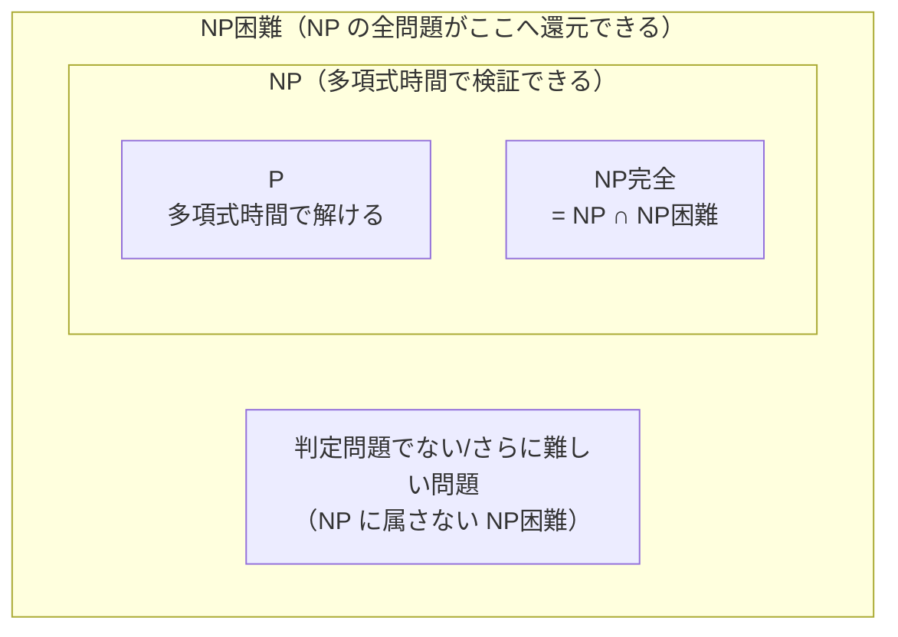

# 第1章 アルゴリズムの役割

## 1.1 アルゴリズムとは？

### 1.1.1 アルゴリズムの定義

アルゴリズムとは、問題を解決するための明確な手順であり、入力から正しい出力を有限時間で生成するものである。

#### 1.1.1.1 問題とは？

問題とは、入力と、その入力に対してどのような出力が正解となるかを定めたものである。

問題に対して、具体的な入力の一つを**インスタンス**（instance）と呼ぶ。

- **問題**：「数列を昇順に並べよ」という抽象的な仕様
- **インスタンス**：「[31, 41, 59, 26, 41, 58] を昇順に並べよ」という具体的な入力

アルゴリズムは特定のインスタンスだけでなく、その問題のすべてのインスタンスに対して正しく動かなければならない。

### 1.1.2 現実で使われるアルゴリズム

ソート問題以外にも、アルゴリズムは現実世界の幅広い場面で役立っている。

- Google マップの経路検索
- DNA の解析（ヒトゲノム計画）
- 電子商取引における安全性の確保（公開鍵暗号方式）

など。たとえば道路は現実世界のものだが、交差点を頂点、道路を辺ととらえれば最短経路問題に落とし込める。このように「解決したいこと」をアルゴリズムが扱える問題の形に変換することが重要である。

100万都市の巡回経路を総当たりで調べると、経路数はほぼ (10^6)! 通りとなり、現実的時間では到底計算できない。

**試算：** スターリングの近似式より、log₁₀((10^6)!) ≈ 5,565,709 なので (10^6)! ≈ 10^5,565,709（約557万桁）。毎秒10億ルート（10^9 通り/秒）を調べられる高速コンピュータを使っても、約 10^5,565,692 年かかる計算になる。宇宙の年齢（約10^10年）の 10^5,565,682 倍であり、比較すら不可能なスケールである。

都市数ごとの感覚値（10^9 通り/秒と仮定）：

| 都市数 | 経路数 | 所要時間 |
|--------|--------|---------|
| 10 | 3.6 × 10^6 | 約 0.004秒 |
| 20 | 2.4 × 10^18 | 約 76年 |
| 25 | 1.6 × 10^25 | 約 5億年 |
| 30 | 2.7 × 10^32 | 約 8,400兆年（宇宙年齢の約60万倍） |
| 10^6 | 10^5,565,709 | 10^5,565,692 年 |

## 1.2 アルゴリズムの性能

アルゴリズムは入力の大きさによって問題を解く速度が変わる。例として、アルゴリズムの実行時間が $f(n)$ μs であるとき、1秒でどのくらいの大きさの問題を解けるかを考える。

$f(n)=n$ の場合は $n=10^6$ の問題を1秒で解ける。しかし $f(n)=n^2$ になると $n=10^3$ まで、$f(n)=2^n$ になると $n=19$ 程度までしか扱えなくなる。

そのため、アルゴリズムの実行時間を評価し、より効率の良い方法を考えることが重要になる。では、具体的にどうやって速くするのか。その鍵の一つが「データ構造」である。

## 1.3 データ構造

データ構造とは、データに対する検索・挿入・削除などの操作を効率よく行うために、データを組織化して保持する方法である。これが、アルゴリズムを高速化する鍵となる。

代表的なデータ構造と、それぞれが得意とする操作（およその計算量）を整理する。

| データ構造 | 得意な操作 | 特徴・計算量の目安 |
|------------|-----------|--------------------|
| 配列 | ランダムアクセス | 添字での参照が $O(1)$。メモリ上で連続。途中への挿入・削除は $O(n)$ |
| 連結リスト | 挿入・削除 | 位置が分かっていれば挿入・削除が $O(1)$。探索は先頭からたどるので $O(n)$ |
| ヒープ | 最大・最小の取り出し | 最大（最小）値の参照が $O(1)$、取り出し・挿入が $O(\log n)$ |
| ハッシュ | 検索 | キーによる検索・挿入・削除が平均 $O(1)$（最悪は $O(n)$） |
| 木（探索木） | 順序付き検索 | 探索・挿入・削除が $O(\log n)$。範囲検索や順序付き走査が得意 |

何を速くしたいかによって、選ぶべきものが変わる。たとえば配列は `a[2]` のようにアクセスする際、メモリ上で連続しているためオフセットを足すだけで即座に参照できる。一方、連結リストでは各要素が次の要素への参照を保持しているため、目的の要素までは順にたどる必要がある。しかし、間に挿入する場合は次のポインタを書き換えるだけで済むため、挿入や削除を繰り返す処理では配列よりも優位になる。このように、用途によって使い分けが求められる。

## 1.4 計算困難な問題

しかし、データ構造やアルゴリズムを工夫しても、効率よく解く方法が知られていない問題も存在する。これらはまとめて **NP完全問題** として知られている。

ここで重要なのは、「知られていない」は「存在しない」とは異なるという点である。効率的なアルゴリズムが人類にまだ発見されていないだけで、将来見つかる可能性も原理的にはある。では実際に存在するのかしないのか——それ自体が未解決であり、「**P vs NP問題**」と呼ばれる。現時点では P≠NP（効率的なアルゴリズムは存在しない）と広く信じられているが、証明はされていない。

この節では、P・NP・NP困難・NP完全という4つの言葉を、授業で説明できるくらいの粒度で整理する。

### 1.4.1 前提：判定問題と「効率的」の定義

NP の理論は **判定問題**（decision problem）、つまり答えが「はい / いいえ」の2択になる問題を土台にして組み立てられている。たとえば「この地図は4色で塗り分けられるか？」は判定問題である。最適化問題（「最小で何色必要か？」）も、「k色で塗れるか？」という判定問題に言い換えれば同じ枠組みで扱える。

また、ここでいう「効率的」とは **多項式時間**（polynomial time）で解けることを指す。入力サイズ $n$ に対して実行時間が $O(n^k)$（$k$ は定数）で抑えられるなら効率的とみなす。$n^2$ や $n^3$ は多項式時間だが、$2^n$ や $n!$ は多項式ではない（指数時間）。多項式と指数の間には、入力が少し増えただけで天と地ほどの差が生まれる（1.1〜1.2 の試算で見たとおり）。

### 1.4.2 P：効率よく「解ける」問題

**P**（Polynomial time）は、**多項式時間で解けるアルゴリズムが存在する判定問題の集合**である。

- 例：ソート、最短経路問題（ダイクストラ法）、2点が連結かどうかの判定など。
- これらは入力が大きくなっても、現実的な時間で答えにたどり着ける「扱いやすい」問題である。

### 1.4.3 NP：効率よく「検証できる」問題

**NP**（Nondeterministic Polynomial time）は、**答えが正しいことを多項式時間で検証できる判定問題の集合**である。ここで鍵になるのは「**証拠**（certificate / witness）があれば」という点。

> 「はい」となる根拠（証拠）を誰かが差し出してくれたとき、それが本当に正しいかを多項式時間でチェックできるなら、その問題は NP に属する。

たとえば巡回セールスマン問題で「総距離 $L$ 以下で全都市を回る経路はあるか？」を考える。実際に短い経路を見つけるのは大変でも、「この順番で回れ」という具体的な経路を1つ渡されれば、距離を足し合わせて $L$ 以下かどうかを確かめるのは一瞬である。**解くのは難しいが、答え合わせは簡単** ——これが NP のイメージである。

ここから自明に **P ⊆ NP** が言える。多項式時間で解けるなら、証拠を待たずとも自力で解いて検証できるからだ。問題は逆、すなわち「検証が簡単な問題はすべて解くのも簡単（NP ⊆ P、つまり P=NP）なのか？」であり、これが未解決の核心である。

### 1.4.4 多項式時間還元（帰着）

NP困難・NP完全を理解する前提として、**還元**（reduction、帰着とも呼ぶ）を押さえる。

問題 A を問題 B に **多項式時間で変換** できる（A のどんなインスタンスも、多項式時間で B のインスタンスに作り替えられ、答えが一致する）とき、

$$
A \le_p B
$$

と書く。これは直感的には「**B が解ければ A も解ける**」、つまり「**B は A 以上に難しい**」ことを意味する。A を解きたければ、入力を B 用に変換し、B のアルゴリズムに通し、その答えをそのまま使えばよい。

### 1.4.5 NP困難と NP完全

この還元の言葉を使うと、2つの概念がきれいに定義できる。

**NP困難**（NP-hard）：NP に属する **すべての** 問題が、その問題へ多項式時間で還元できる問題。

$$
\text{すべての } X \in NP \text{ に対して } X \le_p B \quad\Longrightarrow\quad B \text{ は NP困難}
$$

つまり「NP の中のどんな問題よりも難しい（少なくとも同じくらい難しい）」問題である。注意点として、**NP困難な問題は NP に属していなくてもよい**。判定問題ですらない問題（最適化問題や、そもそも答えが計算不能な問題）も NP困難になりうる。

**NP完全**（NP-complete）：次の2条件をともに満たす問題。

1. その問題自身が **NP に属する**（答えを多項式時間で検証できる）
2. その問題が **NP困難** である

言いかえると、**NP の中で最も難しいグループ**が NP完全である。図にすると以下の関係になる（P≠NP を仮定した場合の包含関係）。

代表的な NP完全問題：充足可能性問題（SAT。最初に NP完全と証明された問題＝クックの定理）、3-SAT、クリーク問題、頂点被覆問題、ハミルトン閉路問題、部分和問題、巡回セールスマン問題の判定版など。

### 1.4.6 「1つ解ければ全部解ける」の意味

NP完全問題は、定義上たがいに還元でつながっている（どれも NP困難なので、NP のすべての問題＝他の NP完全問題からも還元できる）。したがって、

> ある1つの NP完全問題に多項式時間アルゴリズムが見つかれば、還元を経由してすべての NP完全問題が多項式時間で解け、結果として **P=NP** が証明される。

逆に、ある1つでも「多項式時間では解けない」と証明できれば **P≠NP** が確定する。世界中の研究者が数十年挑んで、どちらも示せていない——これが P vs NP 問題の重みである。Clay 数学研究所のミレニアム懸賞問題の1つで、解けば100万ドルが贈られる。

そして、効率の良いアルゴリズムが知られている問題と「よく似ているのに」NP完全、という例が数多くある（章末 Q&A の TSP と最短経路の対比など）。問題をほんの少し変えただけで難しさが跳ね上がるのが、この分野の面白さである。

## 1.5 並列性

長年プロセッサのクロック周波数は一定の割合で向上してきたが、消費電力や発熱といった物理的な制約により、頭打ちに近づいた。そのため近年では、1つのチップに複数コアを載せて並列に計算する方式が主流となっている。

これはある種の並列計算機といえる。マルチコアを活かすにはマルチスレッドという考え方が必要で、それによってアルゴリズムをさらに高速化できる場合がある。

---

## 予想される質問

### 1章全般
- アルゴリズムの定義にある「有限時間」とはどういう意味か？無限ループはアルゴリズムではないのか？

  「有限時間」とは、どんな入力に対しても、いつか必ず終わるということ。「速い」という意味ではなく、「永遠に動き続けない」という意味である。無限ループするものはいつまでも答えを返さないため、アルゴリズムとは呼ばない。なお、「あるプログラムが停止するかどうかを判定するアルゴリズムは存在しない」（停止性問題）ことが証明されており、停止性の保証は一般には難しい問題でもある。

- 「問題」と「インスタンス」の違いは何か？（ソート問題 vs 「この配列をソートする」という具体例）

  問題は、入力と期待する出力の概念のこと。インスタンスは問題に対する具体的な入力の一例のこと。

### アルゴリズムの性能
- なぜ実行時間の絶対値ではなく、入力サイズに対する振る舞いで評価するのか？

  実行時間の絶対値は計算機の性能によっても前後するものであり、アルゴリズムの性能を測ることができないから。

- 2^n や n! の計算量を持つアルゴリズムは実際に存在するのか？

  存在する。2^n の例は「n個の要素の全部分集合を列挙する」処理や、フィボナッチ数列の単純な再帰実装（同じ計算を指数的に繰り返す）。n! の例は「巡回セールスマン問題の全経路を総当たりする」処理や「全順列を生成する」処理。これらは正しく動くが、入力が少し大きくなるだけで現実的な時間では終わらなくなる。

### データ構造
- 「挿入・削除が多ければ連結リスト」と言うが、現代のCPUキャッシュを考えると配列の方が速い場合もあるのでは？

  正しい指摘。現代のCPUはキャッシュという仕組みで、メモリ上で連続したデータをまとめて高速に読み込む。配列はメモリ上で連続しているためキャッシュと相性が良い。連結リストはポインタをたどるたびにバラバラなメモリ番地にアクセスするため、キャッシュが効きにくく実測では遅くなることがある。理論的な計算量だけで選ぶと失敗する場合がある。

- ハッシュがなぜ O(1) で検索できるのか？衝突はどう処理する？

  キーをハッシュ関数という計算式に通すと、配列のインデックス（番地）が得られる。あとはその番地を直接参照するだけなので、要素数によらず一定時間でアクセスできる。衝突（異なるキーが同じ番地になること）が起きた場合は、その番地にリストをぶら下げて複数の値を保持する（チェイン法）か、別の空き番地を探す（オープンアドレス法）などで対処する。衝突が多くなると性能が落ちるため、ハッシュ関数の設計と配列サイズの調整が重要になる。

### 計算困難な問題
- P vs NP問題が未解決とはどういう意味か？（Clay数学研究所の懸賞問題でもある）

  P は「多項式時間で解ける問題」の集合、NP は「答えが正しいか多項式時間で検証できる問題」の集合。P⊆NP は自明（解けるなら検証もできる）だが、NP の全問題が P に入るかどうか、つまり P=NP かどうかが未解決。もし P=NP なら、今は難しいとされる問題が実は効率よく解けることになる。Clay数学研究所のミレニアム懸賞問題の一つで、解けば100万ドルが贈られる。

- 「1つ解ければ全部解ける」とはなぜか？（帰着・還元の概念）

  NP完全問題は互いに「多項式時間で変換できる」関係にある。問題Aを問題Bに変換する操作が多項式時間でできるなら、「BのアルゴリズムでAも解ける」ことになる。NP完全問題はすべてがこの変換関係でつながっているため、1つに効率的なアルゴリズムが見つかれば、残り全部も同じ手順で解けるようになる。

- 巡回セールスマン問題と最短経路問題はどちらも経路を求めるのに、なぜ難しさが違うのか？

  最短経路問題は「2点間を最短で結ぶ経路」を求める問題で、ダイクストラ法により効率よく解ける。巡回セールスマン問題は「全都市をちょうど1回ずつ訪れて戻る最短経路」を求める問題で、「全都市を訪問する」という制約が加わった途端に難しさが跳ね上がる。どの都市を何番目に訪れるかという順序の組み合わせが爆発するためである。

### 並列性
- 並列化すれば何倍でも速くなるのか？（アムダールの法則：並列化できない部分がボトルネックになる）

  ならない。プログラムには必ず「並列化できない部分（順番に処理しなければならない部分）」が存在する。その割合をsとすると、何コアに増やしても速度向上の上限は1/s倍に留まる（アムダールの法則）。たとえば処理の20%が並列化できないなら、コアをいくら増やしても最大5倍にしかならない。

---

## 参考文献

- **CLRS 該当箇所**：第4版 第1章「The Role of Algorithms in Computing」、第34章「NP-Completeness」、第35章「Approximation Algorithms」。
- Cook, S. A. (1971). The complexity of theorem-proving procedures. *STOC '71*. [doi:10.1145/800157.805047](https://doi.org/10.1145/800157.805047) — 充足可能性問題が NP完全であることを示した（クックの定理）。
- Karp, R. M. (1972). Reducibility among combinatorial problems. *Complexity of Computer Computations*. [doi:10.1007/978-1-4684-2001-2_9](https://doi.org/10.1007/978-1-4684-2001-2_9) — 21個の問題が NP完全であることを示し、概念を一気に広めた。
- Rivest, R. L., Shamir, A., & Adleman, L. (1978). A method for obtaining digital signatures and public-key cryptosystems. *Communications of the ACM, 21*(2). [doi:10.1145/359340.359342](https://doi.org/10.1145/359340.359342) — 1.1.2 で触れた公開鍵暗号（RSA）の原典。
- Dijkstra, E. W. (1959). A note on two problems in connexion with graphs. *Numerische Mathematik, 1*. [doi:10.1007/BF01386390](https://doi.org/10.1007/BF01386390) — 最短経路問題を効率よく解くダイクストラ法。
